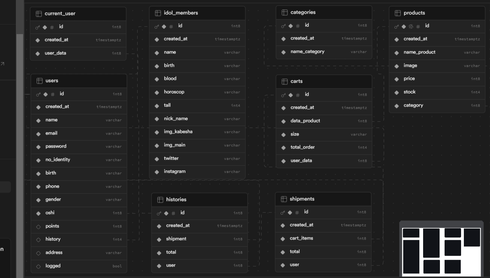

# OSHIVERSE | JKT48 Official Website

#### Sambut dunia JKT48 di website terbarunya! Temukan berbagai fitur menarik yang akan membawa kamu lebih dekat dengan idol favoritmu:

> Oshiverse adalah website yang wajib dikunjungi oleh para penggemar JKT48. Di sini, kamu dapat merasakan pengalaman imersif dan interaktif yang tak terlupakan.
> Proyek ini masih dalam tahap pengembangan, jadi mohon saran dan dukungannya :)

1. Menonton Pertunjukan di Theater JKT48
   - Saksikan pertunjukan teater JKT48 favoritmu secara langsung melalui live streaming.
   - Pilih pertunjukan dan tanggal yang kamu inginkan.
   - Dapatkan akses eksklusif ke behind-the-scene dan konten spesial lainnya.
2. Membeli Merchandise Resmi JKT48
   - Temukan berbagai merchandise resmi JKT48, mulai dari pakaian, aksesoris, hingga album dan single terbaru.
   - Nikmati berbagai promo dan penawaran menarik.
   - Dapatkan merchandise limited edition yang tidak tersedia di tempat lain.
3. Mengecek Data Member JKT48:
   - Temukan informasi lengkap tentang seluruh member JKT48, termasuk profil, biodata, dan fakta menarik.
   - Ikuti perkembangan terbaru member JKT48 melalui blog dan media sosial mereka.
   - Berikan dukungan kepada member favoritmu melalui voting dan polling.
4. Mengecek Jadwal JKT48:
   - Temukan informasi lengkap tentang seluruh jadwal JKT48, termasuk pertunjukan teater, konser, dan event lainnya.
   - Rencanakan agenda kamu dengan mudah dan jangan sampai ketinggalan event favoritmu.
   - Dapatkan update terbaru tentang perubahan jadwal dan pengumuman penting.

### Ayo bergabung dengan JKT48 Universe dan rasakan sendiri sensasi menjadi bagian dari keluarga besar JKT48!

## Fitur

1. Login & Register, gerbang pertama untuk masuk ke dalam aplikasi, jika masih pengguna baru maka bisa mendaftar
2. Merchandise, pengguna bisa membeli beberapa merchandise original JKT48
3. Schedule, pengguna dapat mengecek jadwal dan event JKT48
4. Member, pengguna bisa mengecek data member dan akun sosial medianya
5. Profile, data diri pengguna

## Skema Database

## Tech Stack

- Frontend: PrimeReact & Semantic UI
- Backend: Node.js
- DB: PostgreSQL & Supabase
